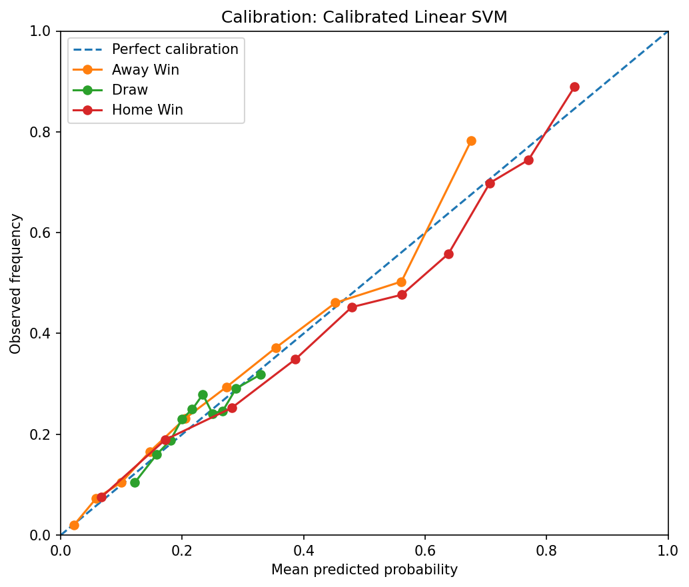
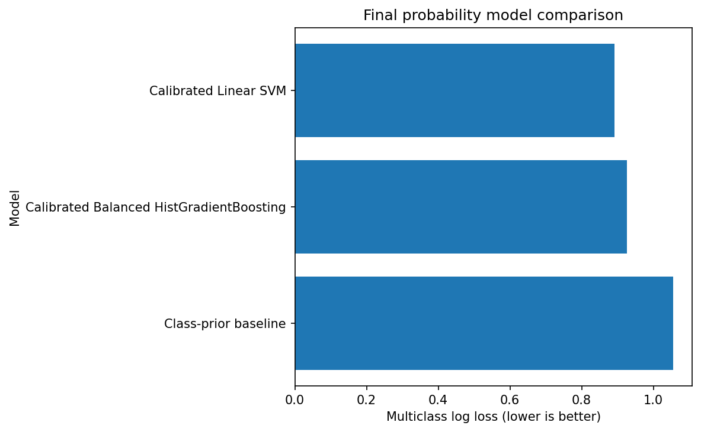
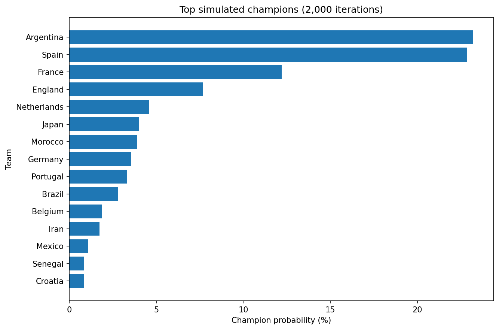

# World Cup Match Outcome Predictor

This project was completed for **ACM40960 - Projects in Maths Modelling** at University College Dublin.

The aim is to predict outcomes of international football matches using historical results, recent team form, Elo ratings and match context, then use those probabilities in a World Cup-style tournament simulation.

The project started from an earlier notebook prototype and went through several rounds of fixes: data-leakage issues, better Elo features, a move from random to chronological evaluation, calibrated model comparison, and finally team-specific tournament probabilities.

## Table of Contents

- [Project Overview](#project-overview)
- [Research Question](#research-question)
- [Dataset](#dataset)
- [Data Preparation](#data-preparation)
- [Feature Engineering](#feature-engineering)
- [Elo Ratings](#elo-ratings)
- [Avoiding Data Leakage](#avoiding-data-leakage)
- [Model Training](#model-training)
- [Model Evaluation](#model-evaluation)
- [Final Results](#final-results)
- [Draw Probability Diagnostic](#draw-probability-diagnostic)
- [Tournament Simulation](#tournament-simulation)
- [Running the Project](#running-the-project)
- [Project Structure](#project-structure)
- [Main Output Files](#main-output-files)
- [Project Poster](#project-poster)
- [Limitations](#limitations)
- [Literature Review](#literature-review)
- [Future Work](#future-work)
- [References](#references)
- [Author](#author)

## Project Overview

International football is hard to forecast. Team strength drifts over time, fixtures are irregular, draws happen a lot, and a tournament outcome depends on a chain of uncertain matches rather than one clean prediction.

This project builds a small, deliberately limited set of features describing recent form, historical team strength and match context, then uses them to model match outcomes and simulate a tournament.

The final pipeline validates completed match results, assigns each match a deterministic `match_id`, builds leakage-safe rolling form, calculates pre-match Elo ratings, and adds tournament importance and neutral-venue information. The data is then split chronologically, and calibrated machine-learning models are compared on the holdout period. The best model is used to build current team-state features, generate team-specific match probabilities, and run those probabilities through a Monte Carlo tournament simulation.

The fixed demonstration input from the early prototype is gone. The tournament simulation now runs on team-specific features generated by the pipeline itself.

## Research Question

Can historical international results, Elo ratings and leakage-safe recent-form features produce useful match probabilities that can be propagated through a World Cup-style tournament simulation?

## Dataset

The main dataset covers international football results over a long historical period. The final validation and modelling stages work with:

| Stage | Number of matches |
|---|---:|
| Raw international matches | 49,287 |
| Completed valid matches | 49,215 |
| Matches used from 2000 onwards | 25,157 |
| Training matches | 21,712 |
| Test matches | 3,445 |

The modelling period runs from 2000-2022 for training and 2023-2026 for testing.

A few supporting files (goalscorers, shootouts, and a mapping of former team names) are used to make the historical data consistent before modelling starts.

## Data Preparation

Raw match data goes through cleaning and validation before any features are built. This includes keeping only completed matches with valid scores, converting dates into a consistent format, and resolving historical team-name changes. Each match then gets a deterministic `match_id`, and the pipeline checks for duplicate fixture keys and validates row counts after every join that matters.

That permanent match identifier matters more than it sounds: it lets Elo ratings and other calculated features get joined back to the correct match without relying on date and team names alone, which turned out to be fragile in the original prototype.

The tournament-weighting logic also got a proper check against the actual tournament names in the dataset, which surfaced a bug in how the Copa América label was being matched. That's fixed now, and the tournament conditions are more explicit as a result.

## Feature Engineering

The final model runs on a relatively small feature set rather than a sprawling one.

### Recent form

Recent form is based on each team's previous five matches: goals scored, goals conceded, and how that shapes recent attacking and defensive form. The current match is always excluded from its own rolling features, which is the whole point of calling it leakage-safe.

### Tournament context

Matches carry two pieces of context: tournament importance and a neutral-venue indicator. Together these give the model a rough sense of whether it's looking at a friendly, a qualifier, or a higher-stakes competitive fixture.

### Match identifiers

A persistent `match_id` connects every calculated feature back to the correct historical fixture, replacing joins based only on `date + home_team + away_team`, which broke down whenever two matches shared a date and teams.

## Elo Ratings

Elo ratings serve as a time-varying measure of team strength. The expected score for team A against team B follows the standard form:

```text
E_A = 1 / (1 + 10^((R_B - R_A) / 400))
```

What matters here is that the Elo value used as a model feature is always the pre-match rating. The actual result only updates the ratings after the pre-match value has already been recorded, and tournament importance feeds into how large that update is.

The notebook exports separate validation files for the Elo process, so the rating calculations can be checked independently of the model that consumes them.

## Avoiding Data Leakage

A large part of this project was making sure information from the current or future match never leaked into its own prediction. The final pipeline checks that the current match is excluded from its own rolling-form features, that same-day appearances use the same pre-date form state, and that Elo ratings are recorded before a result is processed rather than after. Same-day matches don't update Elo against each other, model features are joined through `match_id` rather than date and team name, and the `StandardScaler` is fit on training data only.

The train/test split is chronological, with no overlap between the two periods:

```text
Training: 2000-2022
Testing:  2023-2026
```

That's a more realistic setup for a forecasting problem than mixing earlier and later matches randomly between train and test.

## Model Training

The final comparison covers three candidates: a calibrated Linear SVM, a calibrated and class-balanced HistGradientBoosting model, and a class-prior baseline. Both learned models get the same treatment, calibration using expanding time-based folds rather than random cross-validation, so the comparison between them is fair. The baseline exists so the learned models have something honest to beat: the natural class distribution, nothing more.

## Model Evaluation

The final model is evaluated on matches from 2023-2026 that were never part of training. The metrics tracked are accuracy, Macro F1, log loss, multiclass Brier score, class-wise recall, and probability calibration.

Log loss is the metric that decides model selection, because the tournament simulation downstream uses the full probability vector rather than a single predicted class. That means a model can still be useful for simulation even when one outcome class is rarely its single most likely prediction, which turns out to matter a lot for draws, covered below.

## Final Results

| Model | Accuracy | Macro F1 | Log Loss | Brier |
|---|---:|---:|---:|---:|
| **Calibrated Linear SVM** | **59.62%** | **0.445** | **0.892** | **0.525** |
| Calibrated Balanced HistGradientBoosting | 58.35% | 0.429 | 0.926 | 0.543 |
| Class-prior baseline | 46.85% | 0.213 | 1.056 | 0.637 |

The Calibrated Linear SVM was selected for the final pipeline on the strength of its chronological test-set log loss, the lowest of the three. Against the class-prior baseline, it lifts accuracy from 46.85% to 59.62% and cuts log loss from 1.056 to 0.892.

### Calibration



### Final model comparison



## Draw Probability Diagnostic

Draws are still the hardest outcome once predictions get collapsed into a single answer. On the test set:

- Observed draw rate: 23.08%
- Mean predicted draw probability: 22.45%
- Argmax draw recall: 1.13%

That last number looks bad on its own, and in a strict classification sense it is , draw is almost never the single highest-probability class the model outputs. But the average predicted draw probability tracks the real draw frequency closely, which is the number that actually matters here, because the tournament simulator doesn't pick the highest-probability outcome and stop. It samples from the full away win / draw / home win distribution. A model that quietly assigns realistic draw probability without ever "winning" the argmax is exactly what that simulation needs, which is why calibration and log loss carry more weight in this project than hard draw classification does.

The full diagnostic is in `outputs/draw_probability_diagnostic.csv`.

## Tournament Simulation

The final stage uses the selected model to generate team-specific match probabilities and runs them through a World Cup-style tournament: 48 teams, 12 groups of four, the eight best third-place finishers, and a 32-team knockout stage.

The bundled demonstration run uses 2,000 simulations with a fixed random seed of 42. The resulting championship probabilities:

| Team | Champion probability |
|---|---:|
| Argentina | 23.20% |
| Spain | 22.85% |
| France | 12.20% |
| England | 7.70% |
| Netherlands | 4.60% |
| Japan | 4.00% |
| Morocco | 3.90% |
| Germany | 3.55% |



This is a demonstration of the full modelling pipeline, not an official prediction for the 2026 World Cup. The repository has no authoritative final participant list, so the bundled run uses the top 48 teams from the current Elo snapshot. Group ties are broken by points then Elo, and the knockout pairing is a seeded approximation rather than a reproduction of the official FIFA bracket.

## Running the Project

Clone the repository:

```bash
git clone https://github.com/ACM40960/projects-abhirup-sripal.git
cd projects-abhirup-sripal
```

Create and activate the environment:

```bash
conda env create -f environment.yml
conda activate worldcup
```

Start JupyterLab:

```bash
jupyter lab
```

Open `notebooks/world_cup_predictor.ipynb`, select the **Python (World Cup Predictor)** kernel if it's available, and run the notebook top to bottom from a fresh kernel. Validation files, model results and tournament outputs all land in `outputs/`.

## Project Structure

```text
.
├── data/
│   ├── results.csv
│   ├── goalscorers.csv
│   ├── shootouts.csv
│   └── former_names.csv
│
├── docs/
│   ├── commit checklists
│   ├── feature documentation
│   ├── evaluation notes
│   ├── tournament documentation
│   └── literature/method alignment
│
├── literature/
│   └── original literature review
│
├── notebooks/
│   └── world_cup_predictor.ipynb
│
├── outputs/
│   ├── validation CSV files
│   ├── model comparison files
│   ├── team-state outputs
│   ├── tournament simulation outputs
│   └── figures/
│
├── poster/
│   └── World_Cup_Predictor_A0.pdf
│
├── environment.yml
├── requirements.txt
└── README.md
```

## Main Output Files

Model evaluation:

```text
outputs/probability_model_comparison.csv
outputs/selected_probability_model.csv
outputs/selected_model_calibration.csv
outputs/selected_probability_confusion_matrix.csv
outputs/draw_probability_diagnostic.csv
outputs/hgb_calibration_sensitivity.csv
```

Elo and validation:

```text
outputs/elo_validation.csv
outputs/final_elo_ratings.csv
outputs/rolling_form_validation.csv
outputs/tournament_weight_validation.csv
outputs/chronological_split_validation.csv
outputs/final_run_validation.csv
```

Team-specific prediction:

```text
outputs/team_state_snapshot.csv
outputs/team_specific_prediction_examples.csv
```

Tournament simulation:

```text
outputs/tournament_group_configuration.csv
outputs/tournament_simulation_results.csv
outputs/tournament_simulation_validation.csv
```

Figures:

```text
outputs/figures/selected_model_calibration.png
outputs/figures/final_log_loss_comparison.png
outputs/figures/classification_draw_recall.png
outputs/figures/champion_probabilities.png
```

## Project Poster

**[Download the A0 project poster](poster/World_Cup_Predictor_A0.pdf)**

It covers dataset preparation, leakage-safe feature engineering, Elo methodology, chronological evaluation, the final model comparison, draw probability behaviour, and the tournament simulation.

## Limitations

The model doesn't account for player injuries, squad availability, or player-level strength, and it doesn't take bookmaker odds as an input or model the scoreline directly. It also doesn't have the final confirmed 2026 participant list or the exact official FIFA knockout mapping to work from.

International teams play irregular schedules too, so a five-match form window doesn't represent the same stretch of calendar time for every team. And because the tournament simulation chains many uncertain matches together, the championship probabilities compound that uncertainty rather than resolving it.

## Literature Review

The literature review in `literature/` was written earlier in the project and reflects the methodology as it was planned at the time, which isn't quite what got built. `docs/LITERATURE_METHOD_ALIGNMENT.md` tracks the gap: which ideas from the review made it into the final model, and which stayed as background reading rather than implementation.

## Future Work

Worth exploring next: player availability and injury data, squad-strength or player-level ratings, and a direct comparison against bookmaker probabilities. On the modelling side, different Elo update rules and more dynamic team-strength models are both open questions, along with adding an explicit scoreline model. On the simulation side, using the confirmed 2026 participants and the actual FIFA group/knockout structure would make the tournament output far more meaningful than the current demonstration and running more than 2,000 simulations would tighten the probability estimates themselves.

## References

Three of the main references used during the project:

1. Baboota, R. and Kaur, H. (2019). *Predictive analysis and modelling football results using machine learning approach for English Premier League*. International Journal of Forecasting.

2. Constantinou, A. and Fenton, N. (2012). *Solving the problem of inadequate scoring rules for assessing probabilistic football forecast models*. Journal of Quantitative Analysis in Sports.

3. Strumbelj, E. (2014). *On determining probability forecasts from betting odds*. International Journal of Forecasting.

The full literature review and the rest of the references are in the `literature/` directory.

## Author

**Abhirup and Sripal**,
MSc Data and Computational Science,
University College Dublin

## Retrospective 2026 World Cup validation

This section adds a post-tournament backtest covering all 104 World Cup matches.

The selected Calibrated Linear SVM is frozen for this analysis — actual tournament outcomes were not used to retrain, retune, or reselect the model. Every fixture is evaluated using the March 2026 Elo/form state, and the backtest reports probability metrics, bootstrap uncertainty, draw diagnostics, and a comparison against the actual tournament progression.

Methodology and data provenance are documented in `docs/POST_TOURNAMENT_VALIDATION.md`.

Across the 104 matches, the model scored 60.6% accuracy, 0.884 log loss, and 0.524 multiclass Brier, with 5,000-resample uncertainty intervals in `docs/FINAL_RESULTS.md`.

These results are evaluation-only and don't affect the original model choice.
